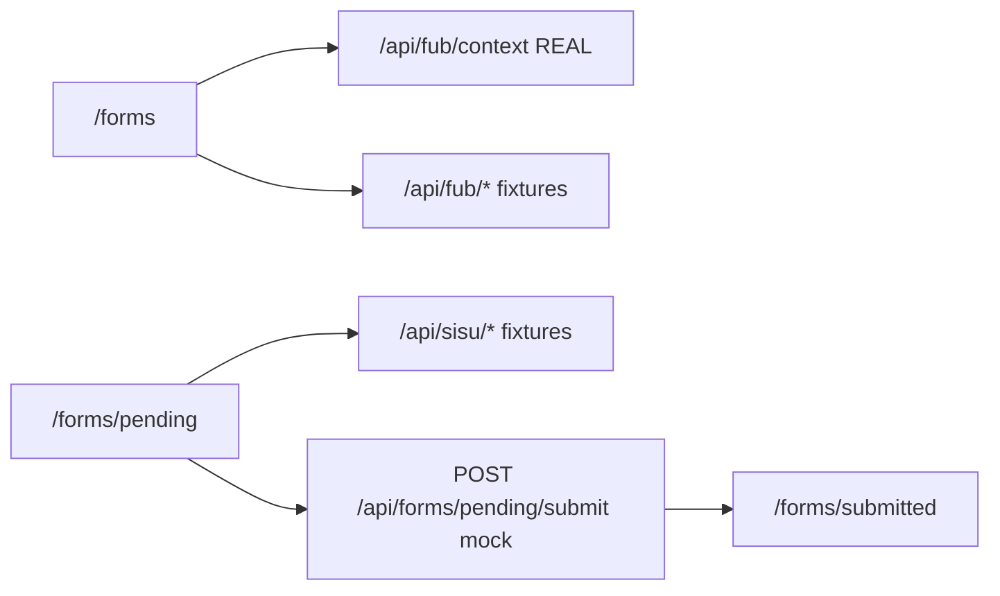

# Template Overview

## Architecture

## What's real vs mocked

| Component | Behavior |
|-----------|----------|
| `/api/fub/context` | Real HMAC verification with `FUB_SECRET_KEY` |
| Other FUB routes | Fixture JSON |
| SISU routes | Fixture JSON |
| Pending submit | Validates form, returns fixture success |
| Postgres / Gmail / Redis | Removed |

## Core directories

- `app/forms/_core/` — reusable form UI, routing, validation, submission helpers
- `app/forms/pending/` — example form to copy
- `app/api/_fixtures/` — mock API response data
