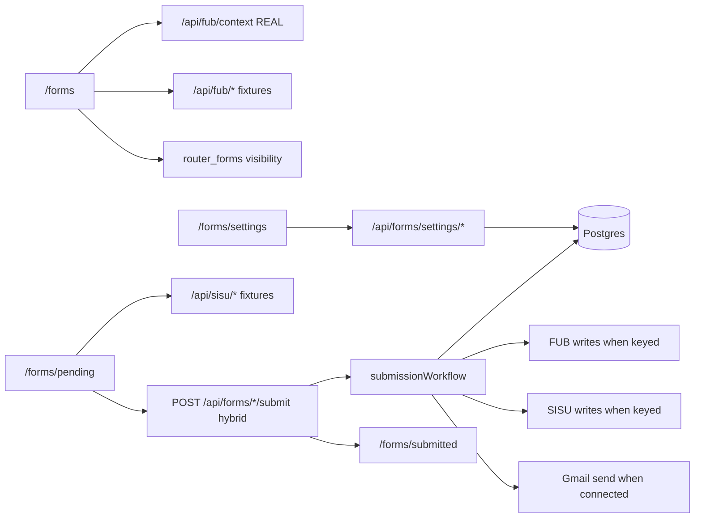

# Template Overview

## Architecture



## What's real vs mocked

| Component | Behavior |
|-----------|----------|
| `/api/fub/context` | Real HMAC verification with `FUB_SECRET_KEY` |
| Other FUB read routes | Fixture JSON (people list live when `FUB_API_KEY` set) |
| SISU read routes | Fixture JSON (team-fields live when `SISU_API_KEY` set) |
| Form submit routes | Validate, then shared hybrid orchestrator |
| `/forms` visibility | Reads `router_forms.visible` when `DATABASE_URL` is set |
| `/forms/settings` | Real Postgres CRUD for router, SISU/FUB maps, recipients; Gmail OAuth when configured |
| Submit workflows | Hybrid: persist `form_submissions`, then best-effort FUB note+email, deal, person, SISU — skip live calls when keys/settings missing |

## Core directories

- `app/root.tsx` — document shell (fonts, CSP, MUI Emotion cache, FUB embed script)
- `app/routes.ts` — React Router route tree (UI + API resource routes)
- `app/routes/` — UI route modules (loaders + pages)
- `app/forms/_core/` — reusable form UI, routing, validation, submission helpers
- `app/forms/settings/` — settings page UI
- `app/forms/pending/` — example form to copy
- `app/api/_fixtures/` — mock API response data
- `app/api/_services/` — Postgres pool, settings repos, live FUB/SISU/Gmail clients
- `app/api/_services/submissionWorkflow/` — shared form submission orchestrator
- `app/api/**/route.ts` — resource route handlers (`loader` / `action`)
- `db/migrations/` — Postgres schema

## Database

Set `DATABASE_URL`, then apply migrations:

```bash
bun run db:migrations
```

Tables include `form_submissions`, `form_sisu_mappings`, `app_audit_log`, `gmail_account_credentials`, `form_email_recipients`, `router_forms`, and FUB stage/tag/person/deal mapping tables.
