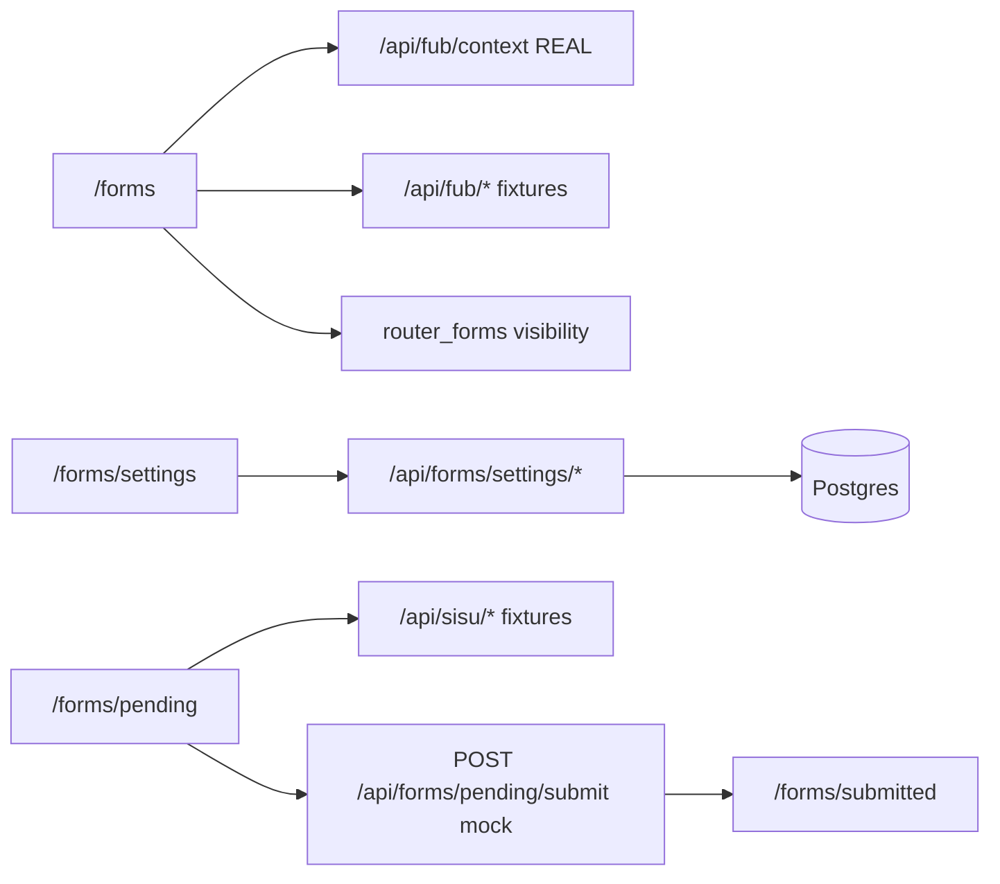

# Template Overview

## Architecture



## What's real vs mocked

| Component | Behavior |
|-----------|----------|
| `/api/fub/context` | Real HMAC verification with `FUB_SECRET_KEY` |
| Other FUB routes | Fixture JSON |
| SISU routes | Fixture JSON |
| Form submit routes | Validate form, return fixture success |
| `/forms` visibility | Reads `router_forms.visible` when `DATABASE_URL` is set |
| `/forms/settings` | Real Postgres CRUD for router, SISU/FUB maps, recipients; Gmail OAuth when configured |
| Submit workflows | Still mocked — do not apply SISU/FUB mappings or send email yet |

## Core directories

- `app/forms/_core/` — reusable form UI, routing, validation, submission helpers
- `app/forms/settings/` — settings page UI
- `app/forms/pending/` — example form to copy
- `app/api/_fixtures/` — mock API response data
- `app/api/_services/` — Postgres pool + settings repos
- `db/migrations/` — Postgres schema

## Database

Set `DATABASE_URL`, then apply migrations:

```bash
bun run db:migrations
```

Tables include `form_submissions`, `form_sisu_mappings`, `app_audit_log`, `gmail_account_credentials`, `form_email_recipients`, `router_forms`, and FUB stage/tag/person/deal mapping tables.
